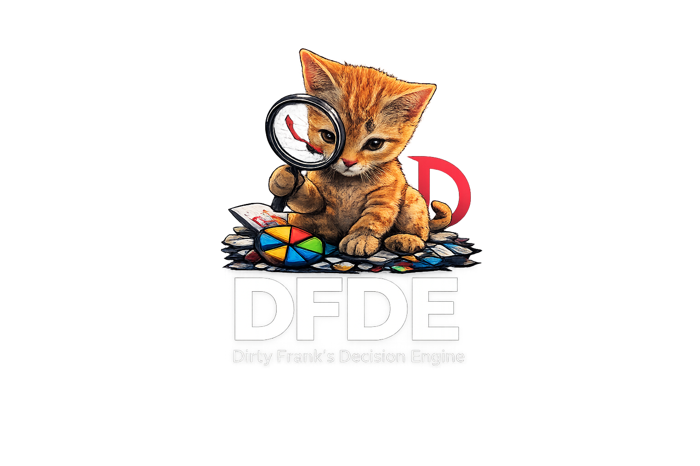
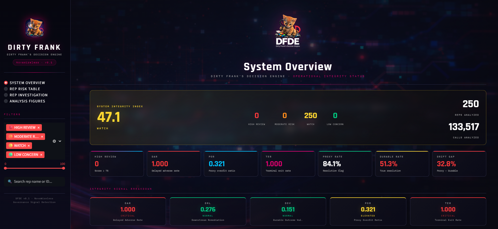
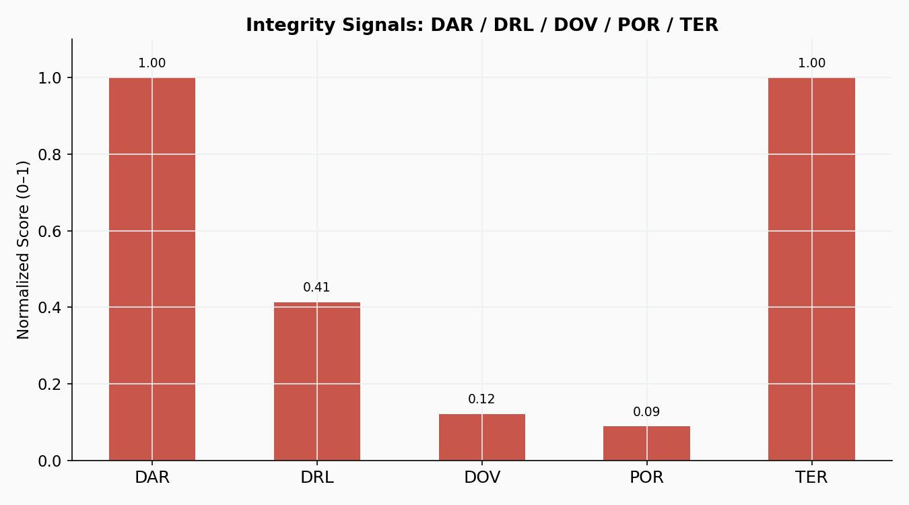
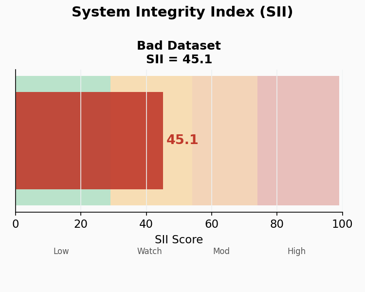
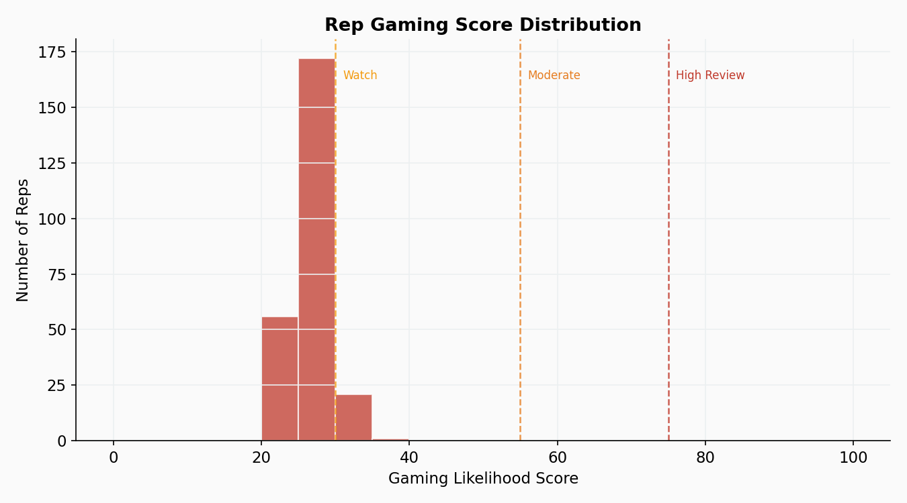
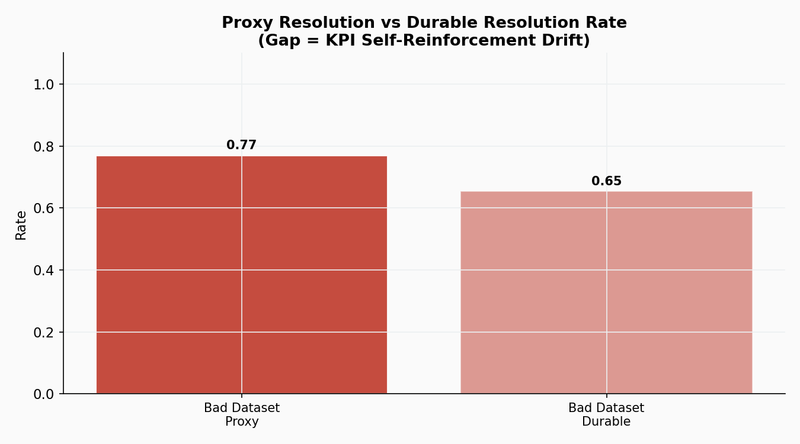

# Dirty Frank's Decision Engine
### Aligned Dataset — Governance Baseline Analysis

**A governance and root-cause detection system for call center permission management**

---

*"When the label is clean, the models will work. The algorithms were never the problem."*
— Aulabaugh (2026), The Corrupted Label Problem in Telecom Churn Prediction

---

## What Is This Repository

This repository contains the **dashboard screenshots, analysis figures, and documentation assets** from the DFDE Aligned dataset analysis — the governance baseline used to validate the integrity signal framework against a population operating under aligned incentive conditions.

This is a **product showcase**, not a code repository. Implementation details are not included.

---

## Why a Separate Aligned Dataset

The Legacy dataset (see companion repository) documents system behavior during a known gaming period. The Aligned dataset provides the comparison baseline — the same 250 agents, the same signal framework, operating under conditions where proxy and durable outcomes are more closely aligned.

**The comparison between these two datasets is the evidence.**

Without a baseline, the Legacy findings are numbers. With a baseline, they are a demonstration.

---

## Aligned Dataset: Key Findings

| Signal | Value | Status |
|---|---|---|
| System Integrity Index (SII) | **45.1** | 🟡 WATCH |
| Proxy Resolution Rate | **76.9%** | Dashboard figure |
| Durable Resolution Rate | **65.3%** | Actual 60-day outcome |
| **Drift Gap** | **11.6pp** | Significantly reduced |
| Delayed Adverse Rate (DAR) | **1.000** | 🔴 CRITICAL |
| Proxy Overfit Ratio (POR) | **0.089** | 🟢 NORMAL |
| Downstream Remediation Load (DRL) | **0.413** | 🟡 ELEVATED |

---

## The Critical Comparison

The side-by-side comparison between Legacy and Aligned datasets is the core finding of this research program:

| Metric | Legacy (Gaming) | Aligned (Baseline) | Difference |
|---|---|---|---|
| Proxy Rate | 84.1% | 76.9% | −7.2pp |
| **Durable Rate** | **51.3%** | **65.3%** | **+14.0pp** |
| **Drift Gap** | **32.8pp** | **11.6pp** | **−21.2pp** |
| POR | 0.321 | 0.089 | −0.232 |
| SII | 47.1 | 45.1 | −2.0 |
| Watch Reps | 250 | 46 | −204 |

**The key insight from this comparison:**

The gaming period reports *higher* proxy resolution (84.1%) than the aligned period (76.9%). By the KPI dashboard, the gaming period looks *better*. But the durable rate tells the opposite story — 51.3% vs. 65.3%. The system gaming its metrics produced worse actual outcomes while displaying better numbers.

This is Goodhart's Law demonstrated empirically, not theoretically.

---

## Dashboard Screenshots

### System Overview — Aligned

*SII = 45.1 (WATCH). Drift gap reduced to 11.6pp. 204 reps moved from Watch to Low Concern.*

---

## Analysis Figures

### Figure 1 — Integrity Signals (Aligned)

*POR drops to 0.09 — proxy and durable outcomes nearly in sync. Compare to Legacy (0.32).*

---

### Figure 2 — SII Gauge (Aligned)

*SII = 45.1. Both datasets in Watch band — but the aligned dataset is measurably closer to Low Concern.*

---

### Figure 3 — Score Distribution (Aligned)

*Scores cluster 20–35 (Low Concern / Watch boundary). Compare to Legacy clustering at 40–55. The whole distribution shifted left — and shows more spread, indicating variation in behavior rather than uniform drift.*

---

### Figure 6 — Proxy vs. Durable (Aligned)

*Proxy 0.77 vs. Durable 0.65. Gap = 12pp. Compare to Legacy: 0.84 vs. 0.51, gap = 33pp.*

---

## What the POR Signal Tells You

The Proxy Overfit Ratio dropping from **0.321 to 0.089** between datasets is the single most diagnostic signal change.

In the gaming period, proxy resolution was improving **32% faster** than durable resolution. In the aligned period, they move together. That is the drift — measured directly.

POR is the velocity sensor. It doesn't just show you the gap — it shows you whether the gap is growing or stable.

---

## What the Score Distribution Tells You

**Legacy dataset:** All 250 agents cluster tightly at 40–55. No outliers. Uniform pattern.

**Aligned dataset:** Scores cluster at 20–35. Wider spread. 204 agents in Low Concern.

The shape of the distribution is the finding. Tight clustering means systemic architecture problem. Wider distribution means individual variation is visible — and actionable.

---

## Formal Integrity Signals

DFDE implements the Trust Signal Health framework from Aulabaugh (2026):

| Signal | Definition | Window |
|---|---|---|
| **DAR** — Delayed Adverse Rate | Repeat contacts following labeled-resolved calls | 31–60 days |
| **DRL** — Downstream Remediation Load | Distributional drift in post-success workload | Rolling |
| **DOV** — Durable Outcome Validation | Decay in proxy label predictive validity | 60-day outcomes |
| **POR** — Proxy Overfit Ratio | Rate at which proxy improves faster than durable outcomes | Rolling |
| **TER** — Terminal Exit Rate | Whether resolutions retain customers or delay churn | 30 days |
| **SII** — System Integrity Index | Weighted composite governance constraint (0–100) | Rolling |

---

## SII Escalation Framework

| SII Range | Status | Required Action |
|---|---|---|
| 0 – 29 | 🟢 LOW CONCERN | Monitor. No intervention required. |
| 30 – 54 | 🟡 WATCH | Review incentive weighting. Audit success definitions. |
| 55 – 74 | 🟠 MODERATE RISK | Stress-test automation policies. Executive awareness required. |
| 75 – 100 | 🔴 HIGH REVIEW | Full executive oversight. All automation policies under review. |
| SII gated = 100 | 🚨 VETO CONDITION | DOV threshold exceeded. Mandatory executive engagement. |

---

## Related Research

This dataset supports the following working papers from the NovaWireless KPI Drift Observatory:

- **When KPIs Lie: Governance Signals for AI-Optimized Call Centers** — Aulabaugh (2026)
- **When KPIs Lie: Addendum B — Cross-Channel Retail Audit** — Aulabaugh (2026)
- **Optimization Pressure and Metric Integrity** — Aulabaugh (2026)
- **Hardening the System Integrity Index** — Aulabaugh (2026)
- **The Corrupted Label Problem in Telecom Churn Prediction** — Aulabaugh (2026)

---

## Companion Repository

The Legacy dataset analysis is available in the companion repository **DFDE_Legacy**, which documents system behavior during a known gaming period for direct comparison against this aligned baseline.

---

## Status

> **ROUGH DRAFT — NOT COMPLETE**
>
> This is a working prototype developed on March 15, 2026 in the seven hours following the NovaWireless Loyalty Promotions and Permission Handling strategic review. Calibration assumptions are documented and pending formal validation.

---

## About

**Author:** Gina Aulabaugh
**Organization:** PixelKraze, LLC
**Role:** T-Mobile Loyalty Care Representative
**Date:** March 15, 2026

Developed independently as a contribution to operational governance research. Correspondence: PixelKraze, LLC.

---

---

## Data Sources

The synthetic datasets used in this research were derived from and substantially
transformed from publicly available sources including IBM Developer (Telco Customer
Churn), Kaggle, FCC.gov, and data.gov. Raw source data is not reproduced in this
repository. All derived datasets encode original theoretical constructs and are the
work of the author.

---

Dirty Frank's Decision Engine v0.1 · PixelKraze, LLC · 2026

